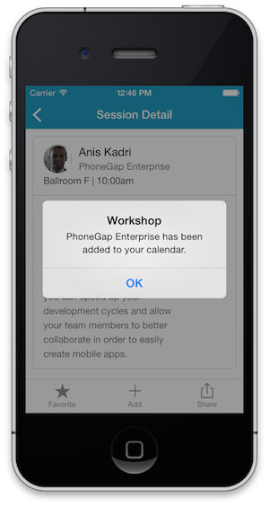

In this section, we add the ability to add a session to the native calendar on the device.

> The code below works when running the application as a PhoneGap app on your device. It should also work in Chrome on the desktop when the page is served with the http:// protocol, and in Firefox, regardless of the protocol (http:// or file://).


## Steps

1. Add this calendar plugin to your project:

  ```
  $ phonegap local plugin add https://github.com/EddyVerbruggen/Calendar-PhoneGap-Plugin.git

  ```

1. In index.html, add the following tab to the tab-bar *session-tpl* template:

      ```
      <div class="addBtn tab-item">
            <span class="icon icon-plus"></span>
            <span class="tab-label">Add</span>
      </div>
      ```

1. In the **initialize()** function of SessionView, register an event listener for the click event of the *Add* tab.

  ```
  this.$el.on('click', '.addBtn', this.addToCalendar);
  ```

  Make sure you add this line as the last line of the **initialize()** function (after this.$el is assigned).

1. In SessionView, define the *addToCalendar* event handler as follows:

    ```
    this.addToCalendar = function() {
        if (window.plugins.calendar) {
            var hour = session.time.substring(0,session.time.indexOf(':'));
            if (session.time.indexOf("pm")>-1)
                hour = parseInt(hour)+12;

            var startDate = new Date(2014,9,23,hour,00,00);
            var endDate = new Date();
            endDate.setTime(startDate.getTime() + 3600000);//one hour

            var calSuccess = function (message) {
                alert(session.title + " has been added to your calendar.");
            };
            var calError = function (message) {
                alert("Error: " + message);
            };
            window.plugins.calendar.createEvent(session.title, session.room, session.description, startDate, endDate,
                function(){alert(session.title + " has been added to your calendar.");}, function (error) {
                    console.log("Calendar fail " + error);
                });
        }
        else alert("Unsupported: You must be running on a device to use this feature.");
    }
    ```

1. Test the Application

You should see a notification such as below, and a new entry added to your native calendar on October 24th:

 

<div class="row" style="margin-top:40px;">
<div class="col-sm-12">
<a href="hardware-acceleration.html" class="btn btn-default"><i class="glyphicon glyphicon-chevron-left"></i> 
Previous</a>
<a href="share.html" class="btn btn-default pull-right">Next <i class="glyphicon 
glyphicon-chevron-right"></i></a>
</div>
</div>


