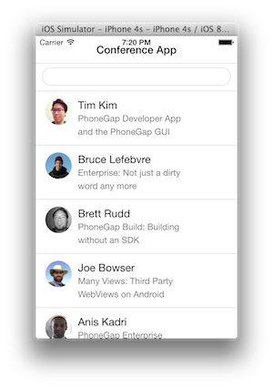

It's time to provide the application with some structure. If we keep adding all the core functions of the application to the immediate function that bootstraps the app, it will very quickly grow out of control. In this section we create a HomeView object that encapsulates the logic to create and render the Home view.

## Step 1: Create the Home View


1. Create a file named HomeView.js in the js directory, and define a **HomeView** constructor implemented as follows:


    ```
    var HomeView = function (service) {
    
    }
    ```

    >The constructor function takes the conference data service as an argument

2. **HomeView** uses a nested view to display the list of sessions. Defining the list of sessions as a separate view makes it reusable in other contexts. We will define SessionListView in Step 2 below. For now, define a local variable to keep track of the nested view.


    ```    
    var HomeView = function (service) {
    
        var sessionListView;
    
    }
    ```

2. Define an initialize() function inside the HomeView constructor.
    - Define a div wrapper for the view. The div wrapper is used to attach the view-related events.
    - Instantiate the nested view (you'll define SessionListView in step 2).
    - Finally, invoke the initialize() function inside the **HomeView** constructor function.

    ```    
    var HomeView = function (service) {
    
        var sessionListView;
        
        this.initialize = function () {
            // Define a div wrapper for the view (used to attach events)
            this.$el = $('<div/>');
            this.$el.on('keyup', '.search-key', this.findByName);
            sessionListView = new SessionListView();
            this.render();
        };
        
        this.initialize();    
    }
    ```

3. Move the **renderHomeView()** function from app.js to the **HomeView** class. To keep the view reusable, attach the HTML to the div wrapper (this.el) instead of the document body. Because the function is now encapsulated in **HomeView**, you can also rename it from **renderHomeView()** to just **render()**.

    ```
    this.render = function() {
        this.$el.html(this.template());
        $('.content', this.$el).html(sessionListView.$el);
        return this;
    };
    ```

4. Move the **findByName()** function from app.js to **HomeView** and adjust it to work with the nested view.

    ```
    this.findByName = function() {
        service.findByName($('.search-key').val()).done(function(sessions) {
            sessionListView.setSessions(sessions);
        });
    };
    ```


## Step 2: Create the SessionList View

1. Create a file named SessionListView.js in the js directory

2. Implement **SessionListView** as follows:

    ```
    var SessionListView = function () {
    
        var sessions;
        
        this.initialize = function() {
            this.$el = $('<div/>');
            this.render();
        };
        
        this.setSessions = function(list) {
            sessions = list;
            this.render();
        }
        
        this.render = function() {
            this.$el.html(this.template(sessions));
            return this;
        };
        
        this.initialize();
    
    }
    ```

## Step 3: Using the Home View

1. In index.html, add script tags to include SessionListView.js and HomeView.js (just **before** the script tag for app.js):

    ```
    <script src="js/SessionListView.js"></script>
    <script src="js/HomeView.js"></script>
    ```


1. In app.js, remove the **renderHomeView()** function.

1. Remove the **findByName()** function.

1. Modify the templates initialization. Instead of declaring them as local variables, add them to the prototype of their respective classes:

    ```
    HomeView.prototype.template = Handlebars.compile($("#home-tpl").html());
    SessionListView.prototype.template = 
                Handlebars.compile($("#session-list-tpl").html());
    
    ```

1. Modify the service  initialization logic to display the Home View when the service  has been successfully initialized. Pass the service  as an argument to the Home View constructor.

    ```
    service.initialize().done(function () {
        $('body').html(new HomeView(service).render().$el);
    });
    ```

1. Test the application



> It should look exactly the same as it did in the previous module but the structure of how it all rendered is now different due to the view classes. 

<div class="row" style="margin-top:40px;">
<div class="col-sm-12">
<a href="handlebars-templates.html" class="btn btn-default"><i class="glyphicon glyphicon-chevron-left"></i> 
Previous</a>
<a href="routing.html" class="btn btn-default pull-right">Next <i class="glyphicon glyphicon-chevron-right"></i></a>
</div>
</div>