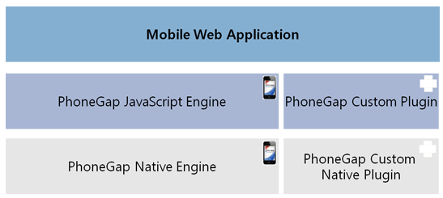

###Developing a Mobile App: Intro to PhoneGap Plugins

PhoneGap plugins allow you to extend the existing PhoneGap functionality to add your own custom features by exposing native code. The plugins are able to communicate via a bridge between the JavaScript and native code. For Android, you write your native plugin code in Java and for iOS you write it in Objective-C. The whole set of [PhoneGap API’s (camera, contacts etc)](http://docs.phonegap.com/en/edge/cordova_plugins_pluginapis.md.html#Plugin%20APIs) were built using this same paradigm. 

You use `cordova.exec()` method in JavaScript (defined in cordova.js) to make calls to the native code. It directly maps to a Java `execute()` method in your native plugin class and has the following parameters including ***success*** and ***error*** callback methods.

###Method Signature for the JS-Native bridge

	exec(<successFunction>, <failFunction>, <service>, <action>, [<args>]);

The parameters are:

- `successFunction` Success function callback. Assuming your `exec()` call completes successfully, this function is invoked (optionally with any parameters you pass back to it).

- `failFunction` 
	Error function callback. If the operation doesn't complete successfully, 	this function is invoked (optionally with an error parameter).

- `service`
	The name of the service to call into on the native side. This is mapped 	to a native class.

- `action`
	The name of the action to call into. This is picked up by the native class receiving the cordova.exec() call, and essentially maps to a class's method.

- `args`
Arguments to pass into the native environment.
	
For example:
	
	cordova.exec(function(winParam) {},
                 function(error) {},
                 "service",
                 "action",
                 ["firstArgument", "secondArgument", 42, false]);

###Classes

####iOS
+ `CDVPlugin`
+ `CordovaPlugin`
+ `CordovaPluginResult`

####Android
	public class Device extends CordovaPlugin {
	}

http://docs.phonegap.com/en/edge/guide_hybrid_plugins_index.md.html#Plugin%20Development%20Guide

http://devgirl.org/2013/09/17/how-to-write-a-phonegap-3-0-plugin-for-android/