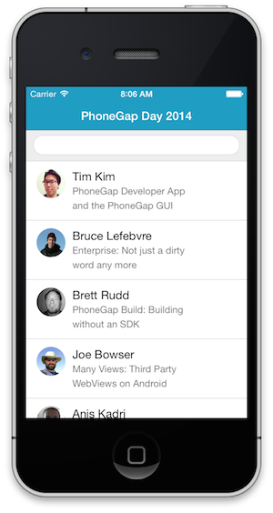
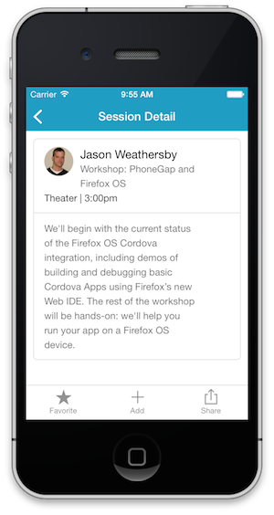

## What You Will Build
In this workshop you will learn how to create a mobile Conference Application using PhoneGap with HTML, JavaScript and CSS. Best
practices and performance techniques will also be taught as you complete each module.

 

## What You Will Learn

- How to create, build and run a PhoneGap project using the CLI (Command Line Interface).

- How to test your app immediately using the [PhoneGap Developer App](app.developer.com) on your mobile device, even without an SDK installed.

- How to handle specific mobile challenges such as touch events, scrolling, styling and page transitions

- How to use several PhoneGap APIs via plugins

## Requirements

- To complete this workshop, all you need is a code editor, a modern browser, and a connection to the Internet.

- A working knowledge of HTML and JavaScript is assumed, but you don't need to be a JavaScript guru.

>A mobile device or a Mobile SDK is **not** a requirement for this tutorial. You will able to test your application in the browser or with the [PhoneGap Developer App](app.developer.com) with some limitations. If you want the full support of the native APIs then you will need the mobile SDK for that platform (iOS SDK, Android SDK, etc.) installed on your system. 

## Issues/Feedback

- Please create an issue [here](https://github.com/hollyschinsky/phonegap-workshop/issues) if you run
into any problem or if you have feedback.

- You can also use the Comments section at the bottom of each module to ask a question or report a problem.

- You can contact me on Twitter:

    <a href="https://twitter.com/devgirlfl" class="twitter-follow-button" data-show-count="true" 
    data-size="large" data-lang="en">Follow 
    @devgirlfl</a>
    

## Credit
- This tutorial was inspired and based on [Christophe Coenraet's Apache Cordova Tutorial](http://coenraets.github.io/cordova-tutorial/).  

<a href="create-project.html" class="btn btn-default pull-right">Next <i class="glyphicon
glyphicon-chevron-right"></i></a>

