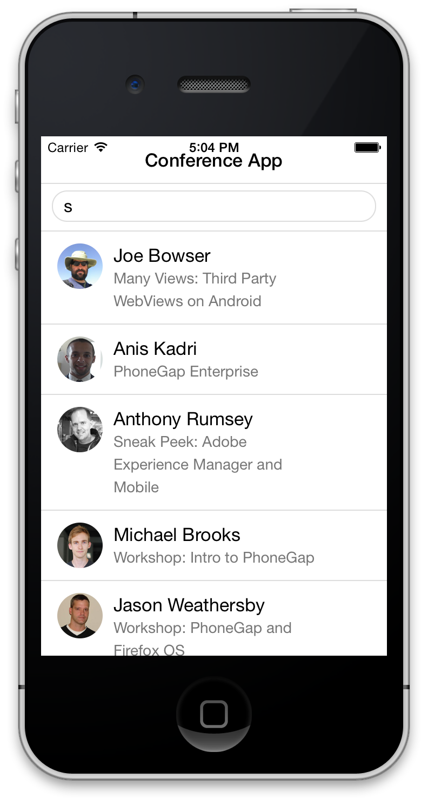
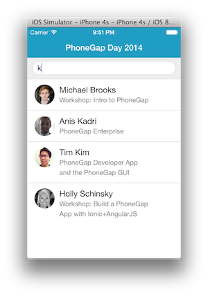

This module is going to take you through a few configuration tips for your mobile application.

###Styling

###Status Bar Handling



In iOS7, the status bar overlaps the application views. As a result, the status bar text may collide with the 
application's header text as shown in the screenshot above. You can fix this issue using the [statusbar plugin](https://github.com/apache/cordova-plugin-statusbar). 

1. Add the status bar plugin:

    ```
    phonegap plugins add org.apache.cordova.statusbar
    ```

There are two options for fixing this issue, via configuration or programmatically. Choose to implement one of the options below:

1. Configuration:
   
   For this particular application, we're going to go through the exercise of changing it using the config.xml so the status bar is no longer
   overlaying the content. We'll also set the text and icons to white and the background color to match the header we currently have.
   
   
   * If you play around with changing values and you haven't set the bounce to false, you can pull the view down to see the status bar text underneath when you have a black or white background and the status bar and icons seem to disappear to indicate the overlay.

   
   Open the config.xml file and add the following lines to the end of the preferences:
   
   ```
       <preference name="StatusBarOverlaysWebView" value="false" />
       <preference name="StatusBarBackgroundColor" value="#209dc2"/>
       <preference name="StatusBarStyle" value="lightcontent" />
       
    ```

1.Programatically:
  In app.js, add the following code at the top of the **deviceready** handler:

    ```
    StatusBar.overlaysWebView( false );
    StatusBar.backgroundColorByHexString('#209dc2');
    StatusBar.styleLightContent();
    ```

Now build the application again and test your application in the iOS emulator or on an iOS device.


    
    
###Keyboard Accessory Bar 

We might want to suppress the accessory keyboard that pops up with the **Done** button on it. To do so, we can 
use a custom plugin from the Ionic Framework and then use a method to hide it:


1. Ionic Keyboard Plugin:

  ```  
  phonegap plugin add https://github.com/driftyco/ionic-plugins-keyboard
  ```
  
  In app.js, add the following code at the top of the **deviceready** handler:


Device Ready check it and set
document.addEventListener('deviceready', function () {
	if (cordova.plugins.Keyboard)
            cordova.plugins.Keyboard.hideKeyboardAccessoryBar(true);
            

