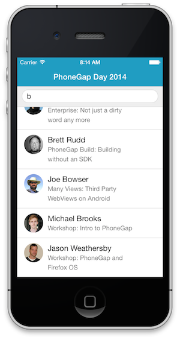
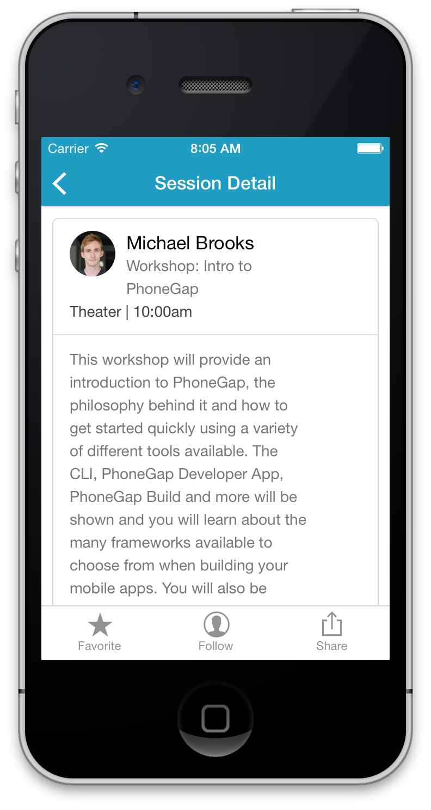

In this section, we add a session details view. Since the application now has more than one view, we also add a simple view routing mechanism.

## Step 1: Create the session template

Open index.html and add a template to render a detailed session view:

  ```
  
  <script id="session-tpl" type="text/template">
      <header class="bar bar-nav">
          <a class="btn btn-link btn-nav pull-left" href="#">
              <span class="icon icon-left-nav"></span>
          </a>
          <h1 class="title">Session Detail</h1>
      </header>
      <div class="content">
          <div class="card">
  
              <ul class="table-view">
                  <li class="table-view-cell media">
                      
                      <div class="media-body">
                          {{ firstName }} {{ lastName }}
                          <p>{{ title }}</p>
                      </div>
                      <p>{{ room }} | {{ time }}</p>
  
                  </li>                
                  <li class="table-view-cell media" style="min-height: 250px">
                      <div> <p>{{ description }}</p></div>
                  </li>                
              </ul>
          </div>
          <nav class="bar bar-tab">
              <a class="tab-item" href="#">
                  <span class="icon icon-star-filled"></span>
                  <span class="tab-label">Favorite</span>
              </a>
              <a class="tab-item" href="#">
                  <span class="icon icon-person"></span>
                  <span class="tab-label">Follow</span>
              </a>
              <a class="tab-item" href="#">
                  <span class="icon icon-share"></span>
                  <span class="tab-label">Share</span>
              </a>
          </nav>
      </div>
 
  ```

## Step 2: Create the SessionView class

1. Create a file named SessionView.js in the js directory, and define it as follows:


  ```var SessionView = function(session) {

      this.initialize = function() {
          this.$el = $('<div/>');
      };

      this.render = function() {
          this.$el.html(this.template(session));
          return this;
      };

      this.initialize();

  }
  ```

2. In index.html, add a script tag to include SessionView.js (just **before** the script tag for app.js):

  ```
  <script src="js/SessionView.js"></script>
  ```


## Step 3: Implement View Routing

1. In index.html, add a script tag to include router.js (just **after** the script tag for jquery.js):

  ```
  <script src="lib/router.js"></script>
  ```

1. Open app.js. Add the compiled session template to the prototype of SessionView:

  ```
  SessionView.prototype.template = Handlebars.compile($("#session-tpl").html());
  ```

1. Define the two routes used in the application:

  ```
  service.initialize().done(function () {
      router.addRoute('', function() {
          $('body').html(new HomeView(service).render().$el);
      });

      router.addRoute('sessions/:id', function(id) {
          service.findById(parseInt(id)).done(function(session) {
              $('body').html(new SessionView(session).render().$el);
          });
      });

      router.start();
  });
  ```

1. Test the application.

     

<div class="row" style="margin-top:40px;">
<div class="col-sm-12">
<a href="creating-view-classes.html" class="btn btn-default"><i class="glyphicon glyphicon-chevron-left"></i> 
Previous</a>
<a href="hardware-acceleration.html" class="btn btn-default pull-right">Next <i class="glyphicon 
glyphicon-chevron-right"></i></a>
</div>
</div>


