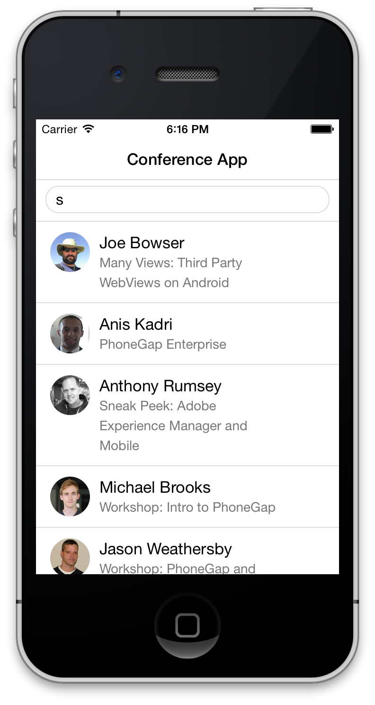

## Step 3: Fixing the Status Bar Issue on iOS7


In iOS7, the status bar overlaps the application views. As a result, the status bar text may collide with the 
application's header text as shown in the screenshot above. You can fix this issue using the [statusbar plugin](https://github.com/apache/cordova-plugin-statusbar). 

1. Add the status bar plugin:

    ```
    phonegap plugins add org.apache.cordova.statusbar
    ```

There are two options for fixing this issue, via configuration or programmatically. Choose to implement one of the options below:

1. Via configuration:
   Open the config.xml file and add the following lines to the end of the preferences:
   
    <preference name="StatusBarOverlaysWebView" value="false" />
    <preference name="StatusBarBackgroundColor" value="#FFFFFF"/>
    <preference name="StatusBarStyle" value="default" />


1.Programatically:
  In app.js, add the following code at the top of the **deviceready** handler:

    ```
    StatusBar.overlaysWebView( false );
    StatusBar.backgroundColorByHexString('#ffffff');
    StatusBar.styleDefault();
    ```

Now build the application again and test your application in the iOS emulator or on an iOS device.

    


